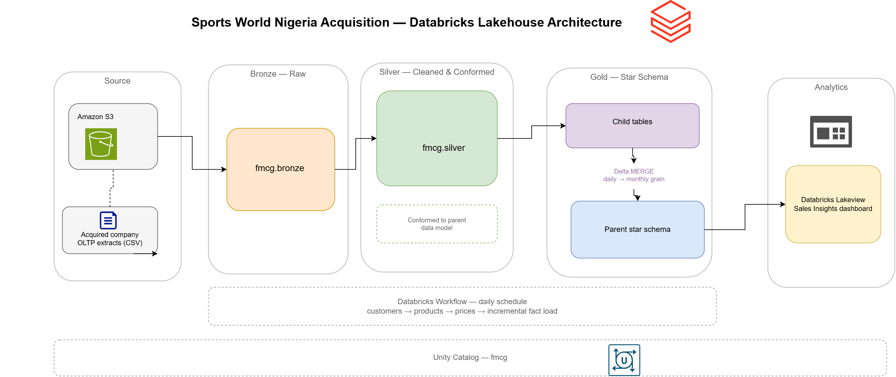
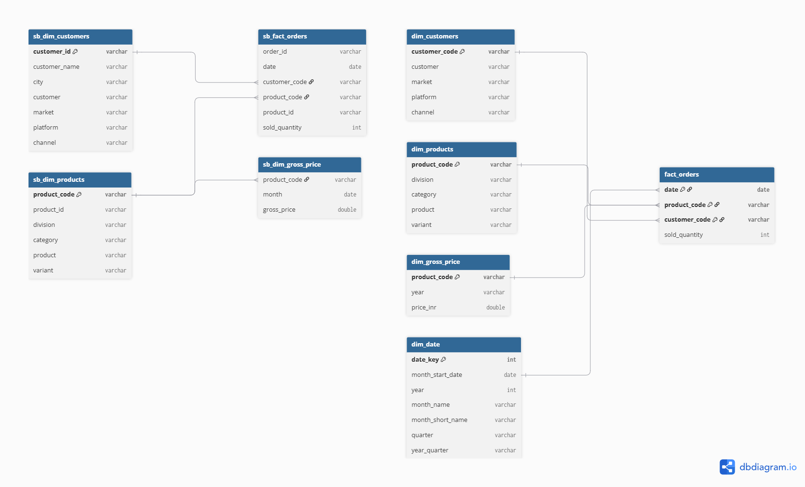
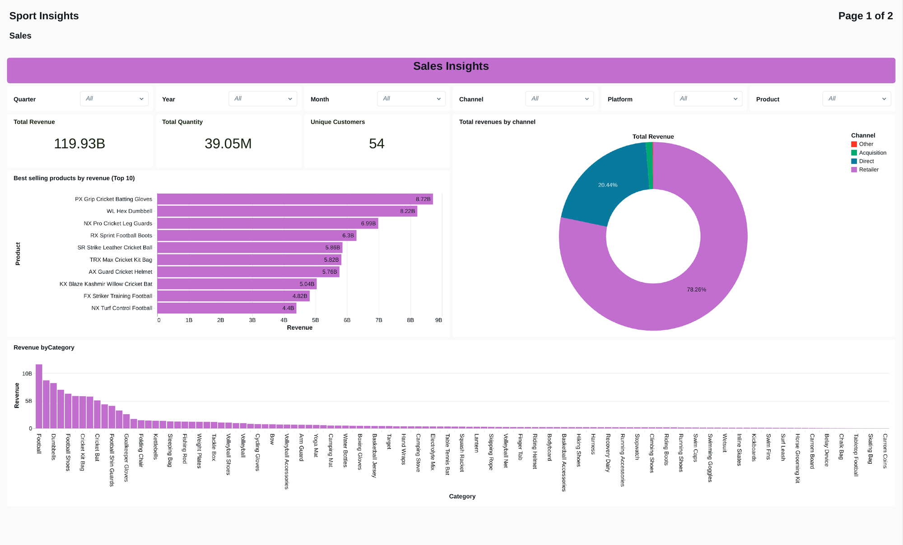
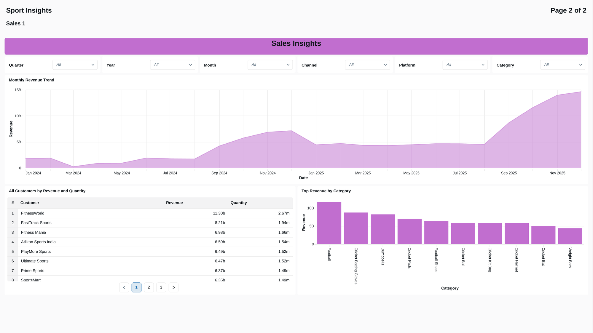

# Sports-Bar-Databricks-ETL

## Purpose
This data pipeline integrates a newly acquired sports nutrition company ("Sports Bar") into a parent sports retailer's existing Databricks lakehouse. The acquired company's operational data arrives as raw CSV extracts in Amazon S3 with inconsistent formats, typos, and a data model that does not match the parent's. The pipeline lands that data in a medallion architecture, standardises it against the parent's schema, and merges it into the parent's existing star schema so both entities can be reported on as a single business. The end result feeds a Databricks Lakeview dashboard for unified sales analytics.

## Architecture


## Data Flow
1. **Data Extraction:** Raw CSV files for customers, products, gross prices, and orders land in an S3 bucket. Notebooks read them with file metadata captured at ingestion.
2. **Bronze Layer:** Data is written to Delta tables as-is with an ingestion timestamp, source file name, and file size, with Change Data Feed enabled.
3. **Silver Layer:** Each entity is cleaned and conformed — deduplication, typo correction, multi-format date parsing, negative price correction, and derivation of the columns the parent model expects.
4. **Gold Layer:** Child-specific tables (`sb_dim_*`, `sb_fact_*`) are produced, then merged into the parent company's existing dimension and fact tables.
5. **Data Orchestration:** A Databricks Workflow runs the dimension notebooks followed by the incremental fact load.
6. **Data Visualization:** A Databricks Lakeview dashboard reads the gold layer for sales insights.

## Technologies Used
- **Databricks:** Hosts the lakehouse, notebooks, and orchestration.
- **Apache Spark (PySpark):** Executes all transformation logic.
- **Delta Lake:** Storage format providing ACID merges and Change Data Feed.
- **Unity Catalog:** Three-level namespace (`fmcg.bronze` / `silver` / `gold`).
- **Amazon S3:** Landing zone for the acquired company's raw CSV extracts.
- **Databricks Workflows:** Orchestrates the notebook sequence.
- **Databricks Lakeview:** Dashboard layer for business reporting.

## Data Model
The parent company's star schema is the integration target. Child data is conformed to it rather than the other way round.

**Parent tables (merge targets)**

| Table | Grain | Key |
| --- | --- | --- |
| `fmcg.gold.fact_orders` | Month × product × customer | `date`, `product_code`, `customer_code` |
| `fmcg.gold.dim_customers` | Customer | `customer_code` |
| `fmcg.gold.dim_products` | Product | `product_code` |
| `fmcg.gold.dim_gross_price` | Product × year | `product_code` |
| `fmcg.gold.dim_date` | Month | `date_key` (`yyyyMM`) |

**Child staging tables**

`sb_dim_customers`, `sb_dim_products`, `sb_dim_gross_price`, `sb_fact_orders` — the acquired company's data in gold shape before it is merged upward.



## ETL Pipeline
The pipeline consists of the following key tasks:

1. **Setup:** Create the catalog and the three medallion schemas.
2. **Dimension Processing:** Clean and conform customers, products, and prices, then merge each into the parent dimension.
3. **Fact Processing:** Load orders through bronze and silver, aggregate to monthly grain, and merge into the parent fact table.
4. **Orchestration:** Chain the notebooks in a scheduled Databricks Workflow.
5. **Data Visualization:** Serve the gold layer to a Lakeview dashboard.

### Setup — `1_Setup.ipynb` and `utilities.ipynb`

```sql
CREATE CATALOG IF NOT EXISTS fmcg;
USE CATALOG fmcg;

CREATE SCHEMA IF NOT EXISTS fmcg.bronze;
CREATE SCHEMA IF NOT EXISTS fmcg.silver;
CREATE SCHEMA IF NOT EXISTS fmcg.gold;
```

Schema names live in a shared utilities notebook loaded by every other notebook via `%run`, so the medallion naming is defined once:

```python
bronze_schema = "bronze"
silver_schema = "silver"
gold_schema   = "gold"
```

### Bronze Layer — ingestion pattern

Every entity uses the same parameterised read. Widgets make `catalog` and `data_source` runtime arguments, so one notebook pattern serves all four sources and the Workflow can pass different values per task.

```python
dbutils.widgets.text("catalog", "fmcg", "Catalog")
dbutils.widgets.text("data_source", "customers", "Data Source")

catalog     = dbutils.widgets.get("catalog")
data_source = dbutils.widgets.get("data_source")
base_path   = f's3://sportstorage20/{data_source}/*.csv'

df = (
    spark.read.format("csv")
        .option("header", True)
        .option("inferSchema", True)
        .load(base_path)
        .withColumn("read_timestamp", F.current_timestamp())
        .select("*", "_metadata.file_name", "_metadata.file_size")
)

df.write.format("delta") \
    .option("delta.enableChangeDataFeed", "true") \
    .mode("overwrite") \
    .saveAsTable(f"{catalog}.{bronze_schema}.{data_source}")
```

Capturing `_metadata.file_name` and `_metadata.file_size` at read time gives every bronze row a traceable lineage back to the file it came from.

### Silver Layer — Customers

The acquired company's customer file carried duplicate IDs, untrimmed and inconsistently cased names, and misspelled city values. Cities were normalised against an allowed list, with anything unrecognised set to null rather than silently kept.

```python
silver_df = bronze_df.dropDuplicates(["customer_id"])
silver_df = silver_df.withColumn("customer_name", F.trim(F.col("customer_name")))

city_mapping = {
    'Bengaluruu': 'Bengaluru', 'Bengalore': 'Bengaluru',
    'Hyderabadd': 'Hyderabad', 'Hyderbad': 'Hyderabad',
    'NewDelhi': 'New Delhi', 'NewDheli': 'New Delhi', 'NewDelhee': 'New Delhi'
}
allowed = ["Bengaluru", "Hyderabad", "New Delhi"]

silver_df = (
    silver_df
    .replace(city_mapping, subset=["city"])
    .withColumn("city",
        F.when(F.col("city").isNull(), None)
         .when(F.col("city").isin(allowed), F.col("city"))
         .otherwise(None))
    .withColumn("customer_name",
        F.when(F.col("customer_name").isNull(), None)
         .otherwise(F.initcap("customer_name")))
)
```

Four customers had no city at all. Rather than dropping them or guessing, the correct values were confirmed with the business and applied through a lookup join:

```python
# City corrections confirmed by business team
customer_city_fix = {
    789403: "New Delhi",   # Sprintx Nutrition
    789420: "Bengaluru",   # Zenathlete Foods
    789521: "Hyderabad",   # Primefuel Nutrition
    789603: "Hyderabad"    # Recovery Lane
}

df_fix = spark.createDataFrame(
    [(k, v) for k, v in customer_city_fix.items()],
    ["customer_id", "fixed_city"]
)

silver_df = (
    silver_df
    .join(df_fix, "customer_id", "left")
    .withColumn("city", F.coalesce("city", "fixed_city"))
    .drop("fixed_city")
)
```

The parent model identifies a customer by a combined name-and-city string and carries market, platform, and channel attributes the child file did not have, so these are constructed:

```python
silver_df = (
    silver_df
    .withColumn("customer",
        F.concat_ws("-", "customer_name", F.coalesce(F.col("city"), F.lit("Unknown"))))
    .withColumn("market",   F.lit("India"))
    .withColumn("platform", F.lit("Sports Bar"))
    .withColumn("channel",  F.lit("Acquisition"))
)
```

Tagging every acquired customer with `channel = "Acquisition"` means the merged fact table can still be sliced by origin after integration.

### Silver Layer — Products

The child catalogue had no join key in common with the parent, a misspelled category, variants embedded in the product name, and no division level in its hierarchy. Each was addressed in turn:

```python
silver_df = bronze_df.dropDuplicates(['product_id'])

silver_df = silver_df.withColumn("category",
    F.when(F.col("category").isNull(), None).otherwise(F.initcap("category")))

# 'protien' → 'protein' in both fields
silver_df = (
    silver_df
    .withColumn("product_name", F.regexp_replace(F.col("product_name"), "(?i)Protien", "Protein"))
    .withColumn("category",     F.regexp_replace(F.col("category"),     "(?i)Protien", "Protein"))
)

# Map child categories up to the parent's division level
silver_df = silver_df.withColumn("division",
    F.when(F.col("category") == "Energy Bars",       "Nutrition Bars")
     .when(F.col("category") == "Protein Bars",      "Nutrition Bars")
     .when(F.col("category") == "Granola & Cereals", "Breakfast Foods")
     .when(F.col("category") == "Recovery Dairy",    "Dairy & Recovery")
     .when(F.col("category") == "Healthy Snacks",    "Healthy Snacks")
     .when(F.col("category") == "Electrolyte Mix",   "Hydration & Electrolytes")
     .otherwise("Other"))

# Pull the variant out of "Protein Bar (60g)" into its own column
silver_df = silver_df.withColumn("variant",
    F.regexp_extract(F.col("product_name"), r"\((.*?)\)", 1))
```

The identifier problem is the interesting one. The parent uses an alphanumeric `product_code`; the child uses a numeric `product_id`, and no natural key links them. A deterministic SHA-256 hash of the product name generates a stable code that produces the same value on every run, making the downstream merge idempotent:

```python
silver_df = (
    silver_df
    .withColumn("product_code", F.sha2(F.col("product_name").cast("string"), 256))
    .withColumn("product_id",
        F.when(F.col("product_id").cast("string").rlike("^[0-9]+$"),
               F.col("product_id").cast("string"))
         .otherwise(F.lit(999999).cast("string")))
    .withColumnRenamed("product_name", "product")
)
```

Invalid product IDs are redirected to a `999999` fallback rather than dropped, so fact records referencing them survive the join instead of disappearing from revenue totals.

### Silver Layer — Gross Price

Dates arrived in four different formats and prices included negatives and non-numeric junk:

```python
silver_df = bronze_df.withColumn("month",
    F.coalesce(
        F.try_to_date(F.col("month"), "yyyy/MM/dd"),
        F.try_to_date(F.col("month"), "dd/MM/yyyy"),
        F.try_to_date(F.col("month"), "yyyy-MM-dd"),
        F.try_to_date(F.col("month"), "dd-MM-yyyy")
    ))

# Negative prices are sign errors — take the absolute value.
# Non-numeric values become 0 and are deprioritised downstream.
silver_df = silver_df.withColumn("gross_price",
    F.when(F.col("gross_price").rlike(r'^-?\d+(\.\d+)?$'),
        F.when(F.col("gross_price").cast("double") < 0, -1 * F.col("gross_price").cast("double"))
         .otherwise(F.col("gross_price").cast("double")))
     .otherwise(0))
```

The parent's price dimension holds one price per product per year, while the child file has monthly prices. A window function picks the most recent non-zero price in each year — the `is_zero` flag sorts first, so a real price always beats a placeholder even if the placeholder is more recent:

```python
df_gold_price = (
    df_gold_price
    .withColumn("year", F.year("month"))
    .withColumn("is_zero", F.when(F.col("gross_price") == 0, 1).otherwise(0))
)

w = Window.partitionBy("product_code", "year").orderBy(F.col("is_zero"), F.col("month").desc())

df_gold_latest_price = (
    df_gold_price
      .withColumn("rnk", F.row_number().over(w))
      .filter(F.col("rnk") == 1)
)
```

### Fact Layer — Orders

Order dates arrived with weekday prefixes ("Tuesday, July 01, 2025") and in several formats:

```python
df_orders = df_orders.filter(F.col("order_qty").isNotNull())

df_orders = df_orders.withColumn("customer_id",
    F.when(F.col("customer_id").rlike("^[0-9]+$"), F.col("customer_id"))
     .otherwise("999999").cast("string"))

# Strip the weekday: "Tuesday, July 01, 2025" → "July 01, 2025"
df_orders = df_orders.withColumn("order_placement_date",
    F.regexp_replace(F.col("order_placement_date"), r"^[A-Za-z]+,\s*", ""))

df_orders = df_orders.withColumn("order_placement_date",
    F.coalesce(
        F.try_to_date("order_placement_date", "yyyy/MM/dd"),
        F.try_to_date("order_placement_date", "dd-MM-yyyy"),
        F.try_to_date("order_placement_date", "dd/MM/yyyy"),
        F.try_to_date("order_placement_date", "MMMM dd, yyyy"),
    ))

df_orders = df_orders.dropDuplicates(
    ["order_id", "order_placement_date", "customer_id", "product_id", "order_qty"])
```

Orders are then joined to silver products to attach the hashed `product_code`, giving the fact rows a key the parent schema recognises.

**Grain reconciliation.** The child records orders daily; the parent fact table is monthly. Daily rows are truncated to month start and summed before the merge:

```python
df_monthly = (
    df_child
    .withColumn("month_start", F.trunc("date", "MM"))
    .groupBy("month_start", "product_code", "customer_code")
    .agg(F.sum("sold_quantity").alias("sold_quantity"))
    .withColumnRenamed("month_start", "date")
)

gold_parent_delta = DeltaTable.forName(spark, f"{catalog}.{gold_schema}.fact_orders")
gold_parent_delta.alias("parent_gold").merge(
    df_monthly.alias("child_gold"),
    "parent_gold.date = child_gold.date "
    "AND parent_gold.product_code = child_gold.product_code "
    "AND parent_gold.customer_code = child_gold.customer_code"
).whenMatchedUpdateAll().whenNotMatchedInsertAll().execute()
```

### Incremental Load

`2_incremental_load_fact.ipynb` handles ongoing daily arrivals. Three mechanisms make it safe to re-run:

**Staging tables.** New files are appended to the permanent bronze table and simultaneously overwritten into a `staging_orders` table, so silver and gold processing operates only on the newly arrived batch rather than rescanning history.

**Landing to processed.** Files are physically moved out of the landing folder after ingestion, so the next run cannot pick them up twice:

```python
files = dbutils.fs.ls(landing_path)
for file_info in files:
    dbutils.fs.mv(file_info.path, f"{processed_path}/{file_info.name}", True)
```

**Affected-month recalculation.** A monthly aggregate cannot simply have new rows added to it — a late-arriving order changes the total for its whole month. The incremental load identifies which months the new data touches, re-aggregates those months in full from the child fact table, and merges the corrected totals:

```python
incremental_month_df = df_child.select(
    F.trunc("date", "MM").alias("start_month")
).distinct()

incremental_month_df.createOrReplaceTempView("incremental_months")

monthly_table = spark.sql(f"""
    SELECT date, product_code, customer_code, sold_quantity
    FROM {catalog}.{gold_schema}.sb_fact_orders sbf
    INNER JOIN incremental_months m
        ON trunc(sbf.date, 'MM') = m.start_month
""")

df_monthly_recalc = (
    monthly_table
    .withColumn("month_start", F.trunc("date", "MM"))
    .groupBy("month_start", "product_code", "customer_code")
    .agg(F.sum("sold_quantity").alias("sold_quantity"))
    .withColumnRenamed("month_start", "date")
)
```

Staging tables are dropped at the end of the run.

### Date Dimension

Generated at monthly grain to match the parent fact table, with a `yyyyMM` surrogate key:

```python
df = spark.sql(f"""
    SELECT explode(
        sequence(to_date('{start_date}'), to_date('{end_date}'), interval 1 month)
    ) AS month_start_date
""")

df = (
    df
    .withColumn("date_key", F.date_format("month_start_date", "yyyyMM").cast("int"))
    .withColumn("year", F.year("month_start_date"))
    .withColumn("month_name", F.date_format("month_start_date", "MMMM"))
    .withColumn("quarter", F.concat(F.lit("Q"), F.quarter("month_start_date")))
    .withColumn("year_quarter",
        F.concat(F.col("year"), F.lit("-Q"), F.quarter("month_start_date")))
)
```

## Orchestration
A Databricks Workflow chains the notebooks so dimensions are conformed before the fact table references them:

```
customer_data_processing
        ↓
products_data_processing
        ↓
price_data_processing
        ↓
2_incremental_load_fact
```

Products must run before prices and orders, since both join to silver products to resolve `product_code`.


## Repository Structure
```
Sports_pipeline/
├── Setup/
│   ├── 1_Setup.ipynb                   # Catalog and schema creation
│   ├── utilities.ipynb                 # Shared schema variables
│   └── dim_date_table_creation.ipynb   # Monthly date dimension
├── dimension_data_processing/
│   ├── customer_data_processing.ipynb
│   ├── products_data_processing.ipynb
│   └── price_data_processing.ipynb
├── fact_data_processing/
│   ├── 1_full_load_fact.ipynb          # Initial historical load
│   └── 2_incremental_load_fact.ipynb   # Ongoing daily loads
└── Dashboard/
    └── Dashboard_Sales.pdf
```

## Development Setup
To run this pipeline in your own workspace:

- Provision a Databricks workspace with Unity Catalog enabled.
- Create an S3 bucket with `customers/`, `products/`, `gross_price/`, and `orders/landing/` prefixes, and configure Databricks access to it.
- Run `1_Setup.ipynb` to create the catalog and medallion schemas.
- Run `dim_date_table_creation.ipynb` to build the date dimension.
- Run the dimension notebooks in order: customers, products, then prices.
- Run `1_full_load_fact.ipynb` once for the historical backfill, then schedule `2_incremental_load_fact.ipynb` for ongoing loads.
- Create a Databricks Workflow chaining the notebooks and set a daily schedule.
- Build a Lakeview dashboard against the gold layer.

## Dashboard
The Databricks Lakeview dashboard reports on the merged parent and child data, filterable by quarter, year, month, channel, platform, product, and category.

**Page 1 — Sales Insights:** total revenue, total quantity, and unique customer KPIs; best-selling products by revenue; revenue by channel; revenue by category.

**Page 2 — Trends and Customers:** monthly revenue trend from January 2024 onward, all customers ranked by revenue and quantity, and top revenue by category.

Because every acquired customer carries `channel = "Acquisition"`, the channel breakdown doubles as a view of how much revenue the acquisition contributes against the parent's existing retail and direct channels.




## Design Notes
- **Deterministic product codes.** Hashing the product name with SHA-256 rather than generating a surrogate key means re-running the pipeline produces identical codes, so the merge into `dim_products` updates in place instead of inserting duplicates.
- **Fallback keys over dropped rows.** Invalid customer and product IDs are mapped to `999999` rather than filtered out, keeping the fact table's revenue totals complete and making the bad records visible in reporting rather than silently absent.
- **Change Data Feed.** Enabled on every Delta write, providing row-level change history for downstream consumers and simplifying future incremental patterns.
- **Full recalculation over incremental addition.** Monthly aggregates are recomputed for any month touched by new data, which is the only correct approach when late-arriving daily records can change a month that has already been published.
